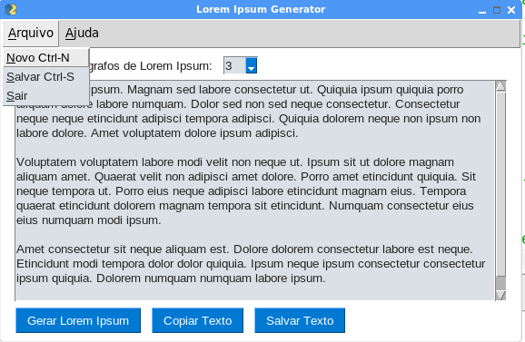

# Lorem-Ipsum-Generator

Este é um Gerador de Textos Lorem Ipsum onde o utilizador tem a opção de escolher a quantidade de parágrafos gerados, copiar o texto criado para a área de transferência ou salvar o texto com o formato *.txt.
Interface gráfica usando <a href='https://github.com/PySimpleGUI/PySimpleGUI'>pysimplegui</a>

# Instalação:
- Acesse o terminal ou prompt de comando de seu computador e crie um clone deste projeto:
~~~
git clone https://github.com/elizeubarbosaabreu/Lorem-Ipsum-Generator.git
~~~
- Sugiro que você utilize uma __máquina virtual__ para instalar os requerimentos: use 
~~~
python -m venv c:\caminho\nome_da_maquina_virtual
~~~ 
no Windows ou:
~~~
python3 -m venv /caminho/nome_da_maquina_virtual
~~~
se estiver no Linux. 
<a href='https://docs.python.org/pt-br/3/library/venv.html'>Documentação do venv aqui...</a>
- Entre dentro da pasta e instale os requerimentos:
~~~python
# Será um dos comandos abaixo:
pip install -r requirements.txt
pip3 install -r requirements.txt
~~~

# Usar o software:
- Use o Pycharm, Thonny, Vs Studio ou outra IDE python para rodar o arquivo 'App.py' para ter a interface gráfica...

# Transforme o App.py em Executável:
- Instale o pyinstaller:
~~~python
# será um dos comandos a depender de seu S.O
pip install pyisntaller
pip3 install pyInstaller
~~~
- E finalmente para gerar o instalador:
~~~python
python pyinstaller App.py
#ou
python3 pyinstaller App.py
~~~